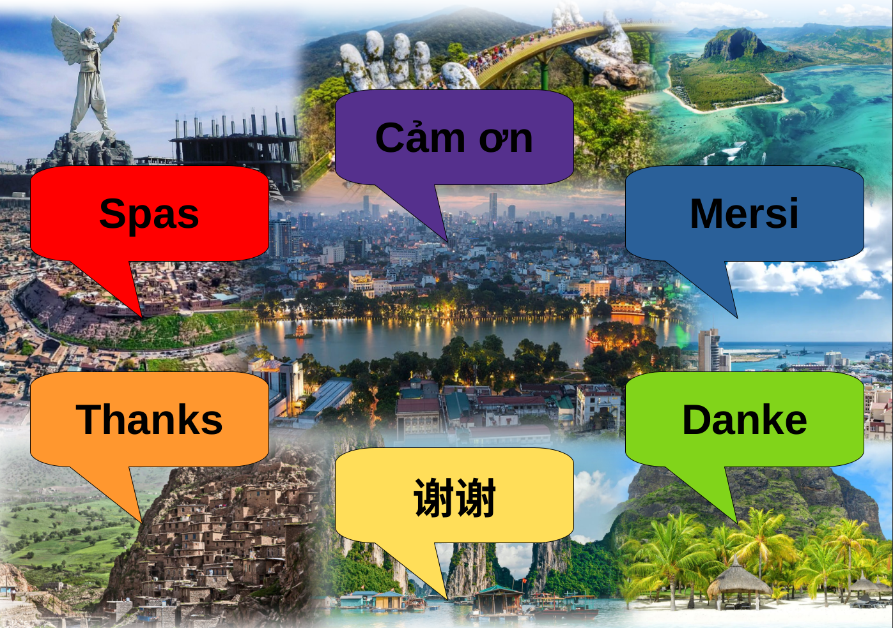

<!-- PROJECT SHIELDS -->
<!--
*** We are using markdown "reference style" links for readability.
*** Reference links are enclosed in brackets [ ] instead of parentheses ( ).
*** See the bottom of this document for the declaration of the reference variables
*** for contributors-url, forks-url, etc. This is an optional, concise syntax you may use.
*** https://www.markdownguide.org/basic-syntax/#reference-style-links
-->
[![Contributors][contributors-shield]][contributors-url]
[![Forks][forks-shield]][forks-url]
[![Stargazers][stars-shield]][stars-url]
[![Issues][issues-shield]][issues-url]
[![Apache License][license-shield]][license-url]
[![LinkedIn][linkedin-shield]][linkedin-url]

<!-- PROJECT LOGO -->
 

    

  <h3 align="center">TextAsCorpusRep</h3>

  

    Multilingual Text As Corpus Repository for Machine Translation of Low-Resource Languages

<!-- ABOUT THE PROJECT -->
## About The Project

Our project started as an idea to addresses low-resource languages, focusing on Mauritian Creole and the Kurdish dialect Kobani. We aim to collect and curate language data to support natural language processing, especially the development of robust translation systems for low-resource languages. 

    

Guiding questions are: 
* (Q1) How to create comprehensive, high-quality language datasets from diverse data sources
of varying quality? 
* (Q2) How can we ensure correct, useful, and quality translations and linguistic
annotations considering variations and dialectal nuances? 

The project targets native speakers, language experts, and language technology practitioners. We follow a data-driven approach, including data acquisition, evaluation, and risk mitigation. Our project can contribute to UN's sustainability goals of Quality Education and Reduced Inequalities by preserving languages, promoting inclusivity, and fostering data literacy.

### Initial Approach

Starting with an ambitious plan made of four phases (see figure below), we sometimes felt like we were only scratching the surface during our one semester long student's project.
 
[![Project Name Screen Shot][project-phases]]()

Nonetheless, we got to learn a lot working on this project and believe to have built a strong foundation for future work to expand on with new translations and annotations.

(<a href="#readme-top">back to top</a>)

<!-- COLLECTED LANGUAGES -->
### Collected Languages

#### Morisien, or Mauritian Creole (mfe)

#### Kobani (has no ISO-code, we use "kob") a dialect of Kurmanji, which is also known as Northern Kurdish (kmr)

#### Vietnamese (vie)

#### Chinese (zho)

(<a href="#readme-top">back to top</a>)

<!-- ADDITIONALLY INCLUDED LANGUAGES -->
### Additionally Included Languages

#### English (eng)

#### German (deu)

#### French (fra)

#### Ukrainian (ukr)

#### Czech (ces)

(<a href="#readme-top">back to top</a>)

<!-- LICENSE -->
## License

Distributed under the Apache License. See `LICENSE.txt` for more information.

(<a href="#readme-top">back to top</a>)

<!-- CONTACT -->
## Contact

Christian Schuler - [@christianschuler8989](https://github.com/christianschuler8989) & [Homepage](https://christianschuler8989.github.io/) - christianschuler8989(4T)gmail.com

Deepesha Saurty - deepesha.saurty@studium.uni-hamburg.de

Tramy Thi Tran - [@TranyMyy](https://github.com/TranMyy) - tramy.thi.tran@studium.uni-hamburg.de

Raman Ahmad - [@RamanAhmad](https://github.com/RamanAhmad) & [Homepage](https://ramanahmad.github.io/)

Ānrán Wáng - [@AnranW](https://github.com/AnranW) - anran.wang (thesymbolforemail)tum.de

(<a href="#readme-top">back to top</a>)

<!-- ACKNOWLEDGMENTS -->
## Acknowledgments

* [Digital and Data Literacy in Teaching Lab](https://www.isa.uni-hamburg.de/ddlitlab.html) who funded this student's project with 10,000€.

A list of helpful resources we would like to give credit to:

* [Best-README-Template](https://github.com/othneildrew/Best-README-Template) 
* [Potato: the POrtable Text Annotation TOol](https://github.com/davidjurgens/potato#potato-the-portable-text-annotation-tool)
* [Language Identification with Support for More Than 2000 Labels](https://github.com/cisnlp/GlotLID)
* [NLLB as part of Fairseq](https://github.com/facebookresearch/fairseq/tree/nllb)
* [NLLB Seed Data](https://github.com/openlanguagedata/seed)
* [(Young et al., 2014) Flickr30k](https://paperswithcode.com/dataset/flickr30k)
* [(Saichyshyna et al., 2023) Extension Multi30K: Multimodal Dataset for Integrated Vision and Language Research in Ukrainian](https://aclanthology.org/2023.unlp-1.7)
* [(Xie et al., 2023) CCMB: A Large-scale Chinese Cross-modal Benchmark](https://arxiv.org/abs/2205.03860)
* [(Elliot et al., 2017) Findings of the Second Shared Task on Multimodal Machine Translation and Multilingual Image Description](https://aclanthology.org/W17-4718/)

(<a href="#readme-top">back to top</a>)

<!-- MARKDOWN LINKS & IMAGES -->
<!-- https://www.markdownguide.org/basic-syntax/#reference-style-links -->
[contributors-shield]: https://img.shields.io/github/contributors/christianschuler8989/TextAsCorpusRep.svg?style=for-the-badge
[contributors-url]: https://github.com/christianschuler8989/TextAsCorpusRep/graphs/contributors
[forks-shield]: https://img.shields.io/github/forks/christianschuler8989/TextAsCorpusRep.svg?style=for-the-badge
[forks-url]: https://github.com/christianschuler8989/TextAsCorpusRep/network/members
[stars-shield]: https://img.shields.io/github/stars/christianschuler8989/TextAsCorpusRep.svg?style=for-the-badge
[stars-url]: https://github.com/christianschuler8989/TextAsCorpusRep/stargazers
[issues-shield]: https://img.shields.io/github/issues/christianschuler8989/TextAsCorpusRep.svg?style=for-the-badge
[issues-url]: https://github.com/christianschuler8989/TextAsCorpusRep/issues
[license-shield]: https://img.shields.io/github/license/christianschuler8989/TextAsCorpusRep.svg?style=for-the-badge
[license-url]: https://github.com/christianschuler8989/TextAsCorpusRep/blob/main/LICENSE
[linkedin-shield]: https://img.shields.io/badge/-LinkedIn-black.svg?style=for-the-badge&logo=linkedin&colorB=555
[linkedin-url]: https://www.linkedin.com/in/christian-schuler-59090a177/
[project-screenshot]: images/title-banner.png
[project-phases]: images/screenshot2.png

