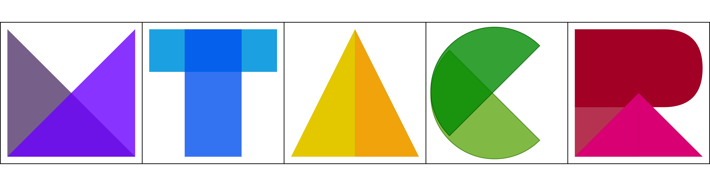

<a name="readme-top"></a>

<!-- PROJECT SHIELDS -->
<!--
*** We are using markdown "reference style" links for readability.
*** Reference links are enclosed in brackets [ ] instead of parentheses ( ).
*** See the bottom of this document for the declaration of the reference variables
*** for contributors-url, forks-url, etc. This is an optional, concise syntax you may use.
*** https://www.markdownguide.org/basic-syntax/#reference-style-links
-->
[![Contributors][contributors-shield]][contributors-url]
[![Forks][forks-shield]][forks-url]
[![Stargazers][stars-shield]][stars-url]
[![Issues][issues-shield]][issues-url]
[![Apache License][license-shield]][license-url]
[![LinkedIn][linkedin-shield]][linkedin-url]


<!-- PROJECT LOGO -->
<br />
<div align="center">
  <a href="https://github.com/christianschuler8989/TextAsCorpusRep">
    
  </a>

  <h3 align="center">TextAsCorpusRep</h3>

  <p align="center">
    Multilingual Text As Corpus Repository for Machine Translation of Low-Resource Languages
    <br />
    <a href="https://github.com/christianschuler8989/TextAsCorpusRep/tree/main/docs"><strong>Explore the docs »</strong></a>
    <br />
    <br />
    <a href="https://github.com/christianschuler8989/TextAsCorpusRep">View Demo (TODO)</a>
    ·
    <a href="https://github.com/christianschuler8989/TextAsCorpusRep/issues">Report Bug</a>
    ·
    <a href="https://github.com/christianschuler8989/TextAsCorpusRep/issues">Request Feature</a>
  </p>
</div>


<!-- TABLE OF CONTENTS -->
<details>
  <summary>Table of Contents</summary>
  <ol>
    <li>
      <a href="#about-the-project">About The Project</a>
      <ul>
        <li><a href="#built-with">Built With</a></li>
      </ul>
    </li>
    <li><a href="#usage">Usage</a></li>
    <li><a href="#roadmap">Roadmap</a></li>
    <li><a href="#contributing">Contributing</a></li>
    <li><a href="#license">License</a></li>
    <li><a href="#contact">Contact</a></li>
    <li><a href="#acknowledgments">Acknowledgments</a></li>
  </ol>
</details>


<!-- ABOUT THE PROJECT -->
## About The Project

[![Project Name Screen Shot][project-screenshot]](https://example.com)

Our project addresses low-resource languages, focusing on Mauritian Creole and Kurdish dialects. We aim to collect and curate language data to support natural language processing, especially the development of robust translation systems for low-resource languages. 

Our research questions are: 
* (Q1) How to create comprehensive, high-quality language datasets from diverse data sources
of varying quality? 
* (Q2) How can we ensure correct, useful, and quality translations and linguistic
annotations considering variations and dialectal nuances? 

The project targets native speakers, language experts, and language technology practitioners. We follow a data-driven approach, including data acquisition, evaluation, and risk mitigation. Our project contributes to UN's sustainability goals of Quality Education and Reduced Inequalities by preserving languages, promoting inclusivity, and fostering data literacy.

<p align="right">(<a href="#readme-top">back to top</a>)</p>


### Built With

List of major frameworks/libraries used/considered to bootstrap this project.

* BeautifulSoup
* Scrapy
* langid.py
* fastText
* spaCy
* NLTK
* KLPT
* ASAB

<p align="right">(<a href="#readme-top">back to top</a>)</p>


## Getting Started
<!-- GETTING STARTED -->
To get a local copy up and running follow these simple steps.

### Prerequisites
* You need a Python installation (tested with: 3.11.5 on macOS & 3.10.9 on Ubuntu)
  - For how to install Python on Windoof refer to: [Using Python on Windows](https://docs.python.org/3.10/using/windows.html)
  - For how to install Python on macOS refer to: [Using Python on a Mac](https://docs.python.org/3.10/using/mac.html)
  - For how to install Python on Linux refer to: The person who introduced you to Linux, and please tell them "The Lannisters send their regards!" (or go to [Using Python on Unix platforms](https://docs.python.org/3.10/using/unix.html))
* You need to use a terminal (at least once ;) )
For more information about how to work with a terminal, refer to [Microsoft's Guide](https://learn.microsoft.com/en-us/windows/terminal/install) for Windoof, [Apple's Guide](https://support.apple.com/de-de/guide/terminal/apd5265185d-f365-44cb-8b09-71a064a42125/2.12/mac/11.0) for macOS, and [Ubuntu's Guide](https://ubuntu.com/tutorials/command-line-for-beginners#1-overview) for Linux systems.


### Installation
Create a directory for the corpus and all your projects to be saved in.
For this description we will call it "MyAwesomeDirectory"
Then navigate into this directory and open the terminal from within it.

1. Clone this repository to get a local copy on your system:
Execute the following lines inside of your terminal.
   ```console
   git clone git@github.com:Low-ResourceDialectology/TextAsCorpusRep.git
   ```
2. (Optional, but recommended) Create a virtual environment:
   1. (If not yet installed) Install python venv:
   ```console
   python3 -m pip install virtualenv
   ```
   or alternatively (at least on Ubuntu) via:
   ```console
   apt install python3.10-venv
   ```
   2. Create an environment named "venvTextAsCorpusRep"
   ```console
   python -m venv venvTextAsCorpusRep
   ```
   3. Activate the virtual environment every time before starting work
   ```console
   source venvTextAsCorpusRep/bin/activate
   ```
3. Navigate into the cloned corpus-directory named "TextAsCorpusRep", so you end up
   ```console
   cd TextAsCorpusRep
   ```
   Assuming you cloned the repository into your "/Home/Download/" directory, you would type
   ```console
   cd /Home/Download/MyAwesomeDirectory/TextAsCorpusRep
   ```
4. Install the requirements:
   ```console
   python -m pip install -r requirements.txt
   ```
5. Usage is managed via the main.py script (continue in <a href="#usage">Usage</a> section below):
   ```console
   python main.py -MODE_TO_OPERATE -l LANGUAGE_A LANGUAGE_B LANGUAGE_C
   ```


<!-- USAGE -->
## Usage

TODO: How to explore/read/use the corpus data.

### (First steps) on Ubuntu 22.04

### (First steps) on Windows 10

### (First steps) on Mac

### Continuing for any operating system

### Collect datasets
```console
python main.py -c -l ger kur mor ukr vie
```

### Preprocess collected data
```console
python main.py -p -l ger kur mor ukr vie
```

### Explore collected and preprocessed data
```console
python main.py -e -l ger kur mor ukr vie
```


<p align="right">(<a href="#readme-top">back to top</a>)</p>


<!-- ROADMAP -->
## Roadmap

- [x] Set up this Repository
- [x] Prior Exploration of Available Data Sets
- [ ] Phase 1: Initial Data Acquisition
    - [ ] Web Crawling and Scraping
        - [ ] Language specific (News-) Websites
        - [ ] Language specific Wikipedia & Similar
    - [ ] Language Identification
        - [ ] Based on already available tools
        - [ ] Own apporach based on linguistic rules
- [ ] Phase 2: Targeting Crucial Aspects
    - [ ] Native Speaker Involvements
        - [ ] Contact Language Communities
        - [ ] Field Worker Data Collection
    - [ ] Exchange with Language Experts
        - [ ] Expert Interviews (Delphi Study?)
        - [ ] Situating Project's Corpus in Research
- [ ] Phase 3: Final Quality Evaluation
    - [ ] Algorithmic Appraches
        - [ ] Structure and Basic Attributes of Data
        - [ ] Tentative Use of Language Models
    - [ ] Mobilizing Naive Speakers
        - [ ] Application for easy use on Smarthpone
        - [ ] Social Media Platforms
- [ ] Finalize Documentation and Release Corpus


See the TODO: [open issues](https://github.com/christianschuler8989/TextAsCorpusRep/issues) for a full list of proposed features (and known issues).

<p align="right">(<a href="#readme-top">back to top</a>)</p>


<!-- CONTRIBUTING -->
## Contributing

Contributions are what make the open source community such an amazing place to learn, inspire, and create. Any contributions you make are **greatly appreciated**.

If you have a suggestion that would make this better, please fork the repo and create a pull request. You can also simply open an issue with the tag "enhancement".
Don't forget to give the project a star! Thanks again!

1. Fork the Project
2. Create your Feature Branch (`git checkout -b feature/AmazingFeature`)
3. Commit your Changes (`git commit -m 'Add some AmazingFeature'`)
4. Push to the Branch (`git push origin feature/AmazingFeature`)
5. Open a Pull Request

<p align="right">(<a href="#readme-top">back to top</a>)</p>


<!-- LICENSE -->
## License

Distributed under the Apache License. See `LICENSE.txt` for more information.

<p align="right">(<a href="#readme-top">back to top</a>)</p>


<!-- CONTACT -->
## Contact

Christian Schuler - [@christians89898](https://twitter.com/christians89898) - christianschuler8989(4T)gmail.com

Deepesha Saurty - deepesha.saurty@studium.uni-hamburg.de

Tramy Thi Tran - [@TranyMyy](https://github.com/TranMyy) - tramy.thi.tran@studium.uni-hamburg.de

Raman Ahmed - 

Anran Wang - [@AnranW](https://github.com/AnranW) - echowanng1996(thesymbolforemail)hotmail.com

<p align="right">(<a href="#readme-top">back to top</a>)</p>


<!-- ACKNOWLEDGMENTS -->
## Acknowledgments

A list of helpful resources we would like to give credit to:

* [Digital and Data Literacy in Teaching Lab](https://www.isa.uni-hamburg.de/ddlitlab.html)
* [Best-README-Template](https://github.com/othneildrew/Best-README-Template) 

<p align="right">(<a href="#readme-top">back to top</a>)</p>


<!-- MARKDOWN LINKS & IMAGES -->
<!-- https://www.markdownguide.org/basic-syntax/#reference-style-links -->
[contributors-shield]: https://img.shields.io/github/contributors/christianschuler8989/TextAsCorpusRep.svg?style=for-the-badge
[contributors-url]: https://github.com/christianschuler8989/TextAsCorpusRep/graphs/contributors
[forks-shield]: https://img.shields.io/github/forks/christianschuler8989/TextAsCorpusRep.svg?style=for-the-badge
[forks-url]: https://github.com/christianschuler8989/TextAsCorpusRep/network/members
[stars-shield]: https://img.shields.io/github/stars/christianschuler8989/TextAsCorpusRep.svg?style=for-the-badge
[stars-url]: https://github.com/christianschuler8989/TextAsCorpusRep/stargazers
[issues-shield]: https://img.shields.io/github/issues/christianschuler8989/TextAsCorpusRep.svg?style=for-the-badge
[issues-url]: https://github.com/christianschuler8989/TextAsCorpusRep/issues
[license-shield]: https://img.shields.io/github/license/christianschuler8989/TextAsCorpusRep.svg?style=for-the-badge
[license-url]: https://github.com/christianschuler8989/TextAsCorpusRep/blob/main/LICENSE
[linkedin-shield]: https://img.shields.io/badge/-LinkedIn-black.svg?style=for-the-badge&logo=linkedin&colorB=555
[linkedin-url]: https://www.linkedin.com/in/christian-schuler-59090a177/
[project-screenshot]: images/screenshot2.png


